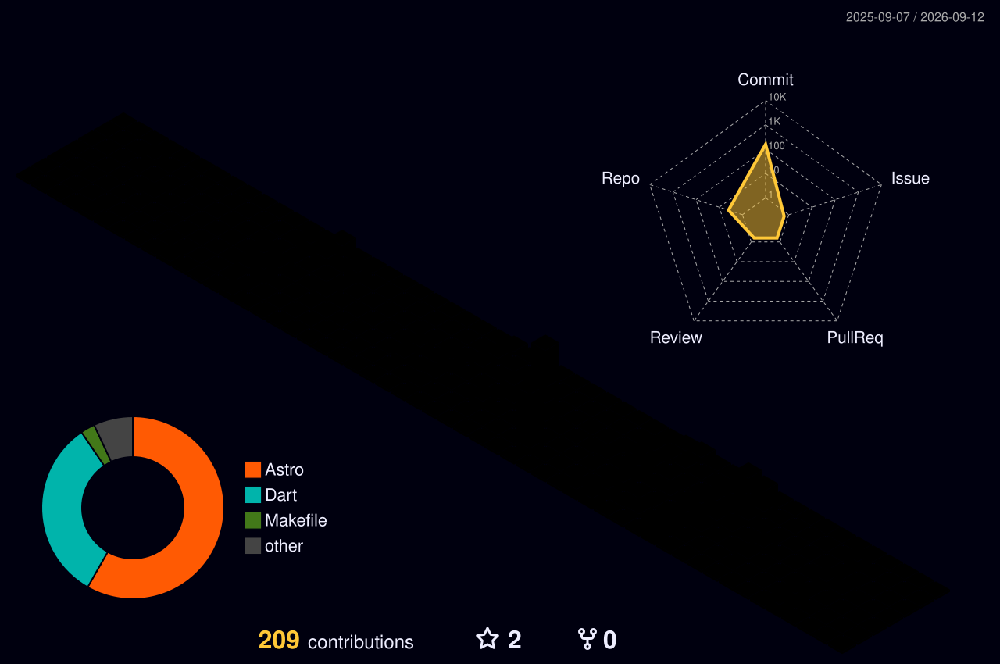

<div align="center">
  


<br>

[](https://git.io/typing-svg)

</div>

<br>

### 💻 Tech Stack

#### 💻 Languages
     

#### 🌐 Frontend Development
      

#### ⚙️ Backend & Server
     

#### 📱 Mobile & AR
  

#### 🎮 Minecraft Ecosystem
 

#### 🗄️ Databases
  

#### 🧠 Machine Learning


#### 📝 IDEs & Editors
    

#### 🤖 AI & Design
 

#### 🛠️ Tools & DevOps
       

<br>

### 📈 Development Activity & Stats

#### ⏱️ Coding Time

<!--START_SECTION:waka-->

```txt
From: 16 August 2025 - To: 08 September 2026

Total Time: 184 hrs 12 mins

Java                       43 hrs 29 mins        █████▓░░░░░░░░░░░░░░░░░░░   22.97 %
Markdown                   34 hrs 10 mins        ████▓░░░░░░░░░░░░░░░░░░░░   18.05 %
Dart                       31 hrs 41 mins        ████▒░░░░░░░░░░░░░░░░░░░░   16.73 %
Astro                      18 hrs 8 mins         ██▒░░░░░░░░░░░░░░░░░░░░░░   09.58 %
Python                     13 hrs 50 mins        █▓░░░░░░░░░░░░░░░░░░░░░░░   07.31 %
Swift                      11 hrs 23 mins        █▓░░░░░░░░░░░░░░░░░░░░░░░   06.02 %
Other                      5 hrs 7 mins          ▓░░░░░░░░░░░░░░░░░░░░░░░░   02.71 %
```

<!--END_SECTION:waka-->
<br>

<div align="center">

[](https://git.io/streak-stats)



</div>

<!-- Proudly created with GPRM ( https://gprm.itsvg.in ) -->
